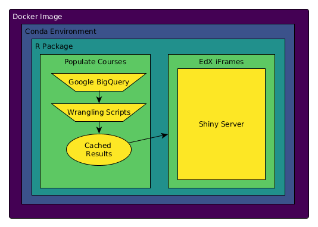

class: center, middle, inverse
# EdxViz Final Competition

Matthew Emery ([@lstmemery](https://github.com/lstmemery)), {TODO: Other authors here}

June 27th, 2017

---

# Why Reproducibility Matters

 - UBC has dozens of MOOCs
 - Other universities may adopt this dashboard
 - Broken dashboards don't get used

---

---
# Project Encapsulation

- All dependencies must be explicit

